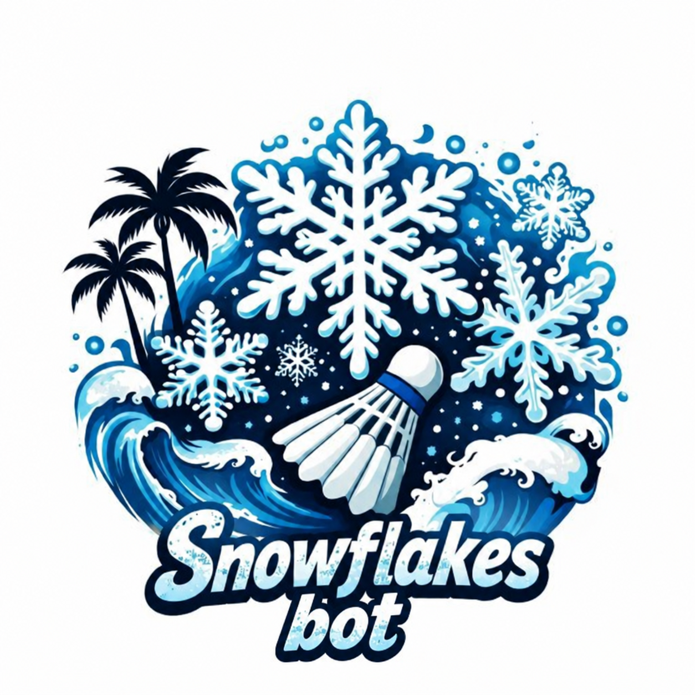

# Бот для расчёта тренировок по бадминтону



Telegram-бот для организатора: участники, гости, локации, время игры, воланы,
оплата корта, расчёт переводов и отметки полных/частичных оплат. Интерфейс на русском.

## Запуск

Нужен Python 3.8+ на macOS/Linux (для нового сервера рекомендуется Python 3.12+).
Внешних Python-зависимостей нет. SQLite входит в стандартную библиотеку.

1. Создайте отдельного бота в [@BotFather](https://t.me/BotFather), команда `/newbot`.
2. В папке проекта выполните `cp .env.example .env`.
3. В `.env` заполните `TELEGRAM_BOT_TOKEN` и `ADMIN_IDS`.
   ID — число, не `@username`. Можно узнать свой ID у [@userinfobot](https://t.me/userinfobot).
   Несколько организаторов перечисляются через запятую. Данные у каждого отдельные.
   Токен не отправляйте в групповой чат и не добавляйте в Git.
4. Проверьте настройки и запустите:

```sh
python3 -m badminton --check
python3 -m badminton
```

Проверка `--check` проверяет формат настроек без сети. При обычном запуске бот проверяет
токен через Telegram. Откройте личный чат с ботом и отправьте `/start`.
Процесс должен продолжать работать; при выключении/сне компьютера бот недоступен.

Для постоянной работы на сервере с Docker Compose:

```sh
docker compose up -d --build
docker compose logs -f
```

Порты и публичный домен не нужны: бот использует long polling по HTTPS.
Запускайте только один экземпляр на токен. Если у бота настроен webhook,
сначала отключите предыдущую интеграцию; приложение не удаляет webhook самостоятельно.

## Использование

1. **Новая тренировка**: дата → сохранённая или новая локация → полная стоимость корта.
2. **Участники**: выбирайте из справочника, добавляйте новых или гостей.
   Новый участник сохраняется для следующих тренировок. Гость — только для текущей.
   Telegram-аккаунт участника не нужен. Совпадающее имя в справочнике означает того же
   человека; для тёзок добавьте фамилию или отличительный признак.
3. По умолчанию у каждого **2 часа и 0 воланов**. Нажмите имя для изменения.
   При вводе количества воланов бот запросит цену за штуку, если она ещё не указана.
   Используется стоимость потраченных на тренировке воланов, а не всей упаковки.
4. **Кто оплатил корт**: укажите сумму для одного или нескольких плательщиков.
   Плательщик может одновременно предоставлять воланы, а может вообще не играть.
   Повторный ввод суммы заменяет прежнюю, не прибавляется к ней; 0 убирает оплату.
5. **Рассчитать**: проверьте доли и предлагаемые переводы, затем зафиксируйте расчёт.
6. **Расчёт и переводы**: выберите перевод и отметьте весь остаток или частичную оплату.
   Ошибочную последнюю отметку можно отменить. Бот не выполняет банковские переводы.
7. **Закрыть тренировку** доступно, когда все переводы отмечены. История сохраняется.

Команды: `/start`, `/new`, `/history`, `/cancel`.
«Сегодня» определяется по времени Таиланда (UTC+7).
Десятичные суммы и часы принимаются с точкой или запятой.

При запуске для каждого организатора автоматически добавляются справочники:

- Участники: Настя, Дима Ск, Дима Си, Андрей Н, Рамиля, Толя, Лена, Маша,
  Саша, Сергей С, Сергей Г, Андрей Г, Дмитро, Серхий, Даша, Натали, Айболит,
  Daniel, Harvest, John.
- Локации: Baam, Grand, SSC.

Повторный запуск не создаёт дубликатов и сохраняет существующие записи.
Эти участники доступны для выбора; состав каждой тренировки задаётся отдельно.

## Правила расчёта

```text
Расходы на воланы человека = количество × цена одного волана
Все расходы = стоимость корта + расходы на воланы всех участников
Доля человека = все расходы × его минуты / суммарные минуты участников
Баланс = доля − предоставленные им воланы − оплаченный им корт
```

Баланс больше нуля — доплатить, меньше нуля — получить возмещение.
Цена корта добавляется к расходам ровно один раз; его оплаты определяют получателей.
Стоимость корта вводится за всю тренировку, не за час и не за один корт.
Все расходы распределяются пропорционально времени, без деления на временные интервалы.
У одного участника одна цена волана на тренировку. Несколько цен у одного человека
в рамках одной тренировки пока не поддерживаются.

Валюта первой версии — THB. Деньги хранятся в целых сатангах (0,01 бата),
время — в целых минутах. Доли сначала округляются вниз, затем оставшиеся сатанги
добавляются участникам с наибольшими дробными остатками. При равенстве используется
постоянный ID человека. Общая сумма всегда сходится. Переводы строятся детерминированно;
минимальное возможное количество переводов не гарантируется.

Нельзя зафиксировать расчёт с пустым составом, нераспределённой оплатой корта
или ненулевым количеством воланов без цены. Участники могут иметь разное время и цены.
Состав и параметры каждой тренировки независимы.

## Исправления, надёжность и хранение

- До фиксации можно менять состав, время, расходы, дату и локацию.
- После фиксации для изменения исходных данных нужно отменить отмеченные переводы
  и выбрать «Вернуть к редактированию». Закрытую тренировку можно открыть снова.
- Расчёт хранится вместе с конкретными переводами. Оплаты не добавляются к расходам.
- SQLite сохраняет справочники, тренировки, переводы, состояние ввода и очередь ответов.
- Каждое входящее событие обрабатывается в транзакции. Повторная доставка события
  не повторяет денежную операцию. Старые кнопки не работают после перехода к новому меню.
- Ответы сохраняются до отправки и повторяются при сетевых сбоях. В редком случае
  обрыва связи после принятия сообщения Telegram возможен повтор ответа, но не оплаты.
- Доступ разрешён только `ADMIN_IDS`, только в личных чатах. Участники не получают
  автоматических личных сообщений; организатор может переслать итог вручную.
- Бот не проверяет банковские поступления: отметки делает организатор.
- Локальная база: `data/badminton.sqlite3`. В Docker — именованный том `bot-data`.
  Для резервной копии остановите бота и скопируйте весь каталог данных/том, затем
  запустите снова. Не удаляйте том через `docker compose down -v`, если нужна история.
- Не меняйте токен на другого бота, сохраняя прежнюю базу: offset относится к одному боту.

## Проверка

```sh
python3 -m unittest discover -v
```

Тесты не обращаются в Telegram и не требуют токена. Проверяются пример из таблицы,
разное время и цены, несколько плательщиков, округление и сохранение баланса,
диалог, восстановление после перезапуска, частичные оплаты, отмена, права доступа,
устаревшие кнопки и повторная доставка событий.

Документация протокола: [Telegram Bot API](https://core.telegram.org/bots/api).
